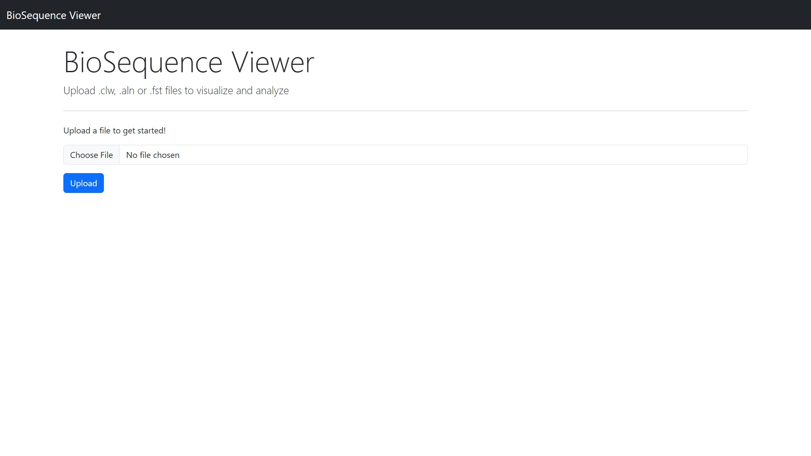
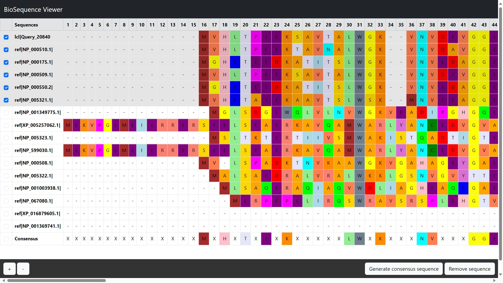

# BioSequence Viewer

#### Description:
A simple webapp to view biological sequences that can also generate a 100% consensus sequence
between the sequences that are selected. This program was inspired by the SeaView
application (https://doua.prabi.fr/software/seaview), but did not use any part of it.

#### Screenshot:



## Usage
This program runs on the Flask framework within python, so you need to make sure flask was
installed using:

```
pip install Flask
```

To run the web-server type the following command on the terminal:

```
python -m flask run
```

Then access the server from the browser at the link printed in the terminal.

## Documentation
### app.py
This is the python program that is needed to run a Flask server. It handles two routes: the
main page ("/") in which files can be uploaded and the sequence browser ("/view").

### helpers.py
This file contains the parse functions that read the files that have been uploaded by the
user and converts them in a list of dictionaries that have the sequence name as the key and
the sequence as the value. There are three function, each of which handles a different file
type.

### layout.html
This is the part of the html that is shared between all pages of the webapp. It makes the
page responsive, imports the bootstrap libraries and specifies the icon and adds a navbar to
the top.

### index.html
This page welcomes the user and handles the file upload posting it to the "/view" route.

### sequence.html
This page shows the sequences list that has been prepared by the parse functions in
helpers.py as a table. The table has the sequence indexes on the top row, checkboxes to
select the sequence in the first column, the name of the sequences on the second column, and
the actual sequence as the following columns.

The cells have a different colour based on the letter they contain to make it easier to
recognise common elements.

On the bottom of the page there is a navbar that contains the buttons to make the table
bigger or smaller, to remove the selected sequences and to generate the consesus sequence
between the selected sequences.

#### JavaScript scripts
##### Zooming
This script listens for clicks on the zoom buttons of the navbar and makes the table bigger
or smaller using the transform() function.

##### Sequence selection
This script listens for clicks on the checkboxes and assigns the "table-active" class to
the checked rows.

##### Sequence removal
This script listens for clicks on the "Remove sequence" button. Once clicked, it gathers the
selected rows based on the presence of the class "table-active" and removes them from the
table.

##### Consensus sequence generation
This script listens for clicks on the "Generate consensus sequence" button. Once clicked, it
gathers, column by column (starting from the third column, as the first two columns contain
the checkboxes and the sequence names respectively), all the letters contained in the
selected rows. The script then stores the letters that were the same in all rows in a
consensusSeq variable, the positions in which no consensus could be found are filled with an
"X".

The consensusSeq is displayed in a new row with the coulors of the letter matching the
previous color scheme. The new row retains the ability to be selected, be removed, or used to
generate a consensus sequence.


